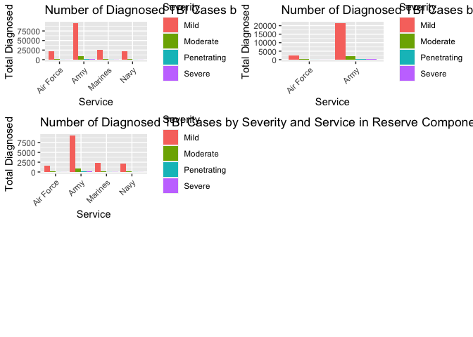
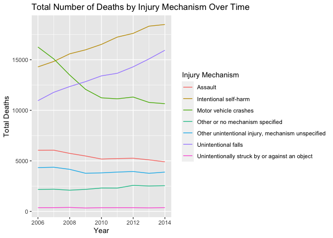
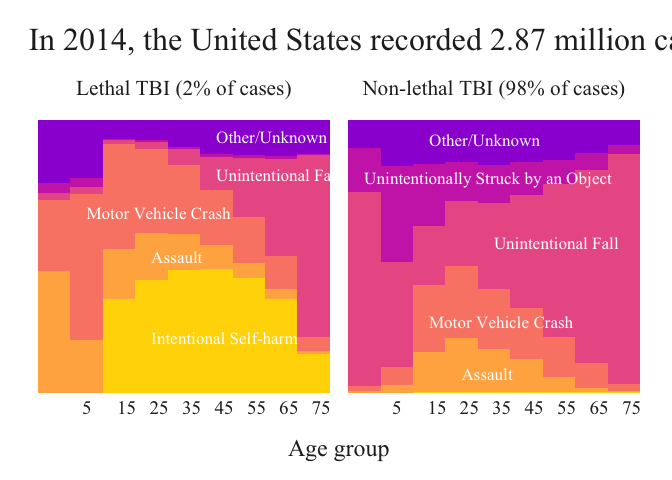

Traumatic Brain Injury
================
Zenthia Song

## Get the data

``` r
# Load the necessary libraries
library(tidyverse)
```

    ## ── Attaching core tidyverse packages ──────────────────────── tidyverse 2.0.0 ──
    ## ✔ dplyr     1.1.2     ✔ readr     2.1.4
    ## ✔ forcats   1.0.0     ✔ stringr   1.5.0
    ## ✔ ggplot2   3.4.2     ✔ tibble    3.2.1
    ## ✔ lubridate 1.9.2     ✔ tidyr     1.3.0
    ## ✔ purrr     1.0.1     
    ## ── Conflicts ────────────────────────────────────────── tidyverse_conflicts() ──
    ## ✖ dplyr::filter() masks stats::filter()
    ## ✖ dplyr::lag()    masks stats::lag()
    ## ℹ Use the conflicted package (<http://conflicted.r-lib.org/>) to force all conflicts to become errors

``` r
library(dplyr)
library(tidyr)
library(gridExtra)
```

    ## 
    ## Attaching package: 'gridExtra'
    ## 
    ## The following object is masked from 'package:dplyr':
    ## 
    ##     combine

``` r
library(ggtext)

# Loading data
tbi_age <- read_csv("https://raw.githubusercontent.com/rfordatascience/tidytuesday/master/data/2020/2020-03-24/tbi_age.csv", show_col_types = FALSE)
tbi_year <- readr::read_csv('https://raw.githubusercontent.com/rfordatascience/tidytuesday/master/data/2020/2020-03-24/tbi_year.csv', show_col_types = FALSE)
tbi_military <- readr::read_csv('https://raw.githubusercontent.com/rfordatascience/tidytuesday/master/data/2020/2020-03-24/tbi_military.csv', show_col_types = FALSE)
```

## Explore the data

``` r
# Summary and check the data
glimpse(tbi_age)
```

    ## Rows: 231
    ## Columns: 5
    ## $ age_group        <chr> "0-17", "0-17", "0-17", "0-17", "0-17", "0-17", "0-17…
    ## $ type             <chr> "Emergency Department Visit", "Emergency Department V…
    ## $ injury_mechanism <chr> "Motor Vehicle Crashes", "Unintentional Falls", "Unin…
    ## $ number_est       <dbl> 47138, 397190, 229236, 55785, NA, 24360, 57983, 5464,…
    ## $ rate_est         <dbl> 64.1, 539.8, 311.6, 75.8, NA, 33.1, 78.8, 27.5, 1161.…

``` r
glimpse(tbi_year)
```

    ## Rows: 216
    ## Columns: 5
    ## $ injury_mechanism <chr> "Motor vehicle crashes", "Motor vehicle crashes", "Mo…
    ## $ type             <chr> "Emergency Department Visit", "Emergency Department V…
    ## $ year             <dbl> 2006, 2007, 2008, 2009, 2010, 2011, 2012, 2013, 2014,…
    ## $ rate_est         <dbl> 85.3, 83.8, 83.9, 88.7, 95.3, 98.7, 99.9, 99.6, 106.0…
    ## $ number_est       <dbl> 254793, 252459, 254391, 270240, 292942, 305694, 31127…

``` r
glimpse(tbi_military)
```

    ## Rows: 450
    ## Columns: 5
    ## $ service   <chr> "Army", "Army", "Army", "Army", "Army", "Army", "Army", "Arm…
    ## $ component <chr> "Active", "Active", "Active", "Active", "Active", "Guard", "…
    ## $ severity  <chr> "Penetrating", "Severe", "Moderate", "Mild", "Not Classifiab…
    ## $ diagnosed <dbl> 189, 102, 709, 5896, 122, 33, 26, 177, 1332, 29, 12, 11, 63,…
    ## $ year      <dbl> 2006, 2006, 2006, 2006, 2006, 2006, 2006, 2006, 2006, 2006, …

``` r
# Explore number estimates by age group and injury mechanism
tbi_age_num <- tbi_age %>%
  group_by(age_group, injury_mechanism) %>%
  summarise(total_number_est = sum(number_est, na.rm = TRUE), .groups = "drop")

tbi_age_num
```

    ## # A tibble: 77 × 3
    ##    age_group injury_mechanism                                  total_number_est
    ##    <chr>     <chr>                                                        <dbl>
    ##  1 0-17      Assault                                                      26506
    ##  2 0-17      Intentional self-harm                                            0
    ##  3 0-17      Motor Vehicle Crashes                                        53899
    ##  4 0-17      Other or no mechanism specified                              60639
    ##  5 0-17      Other unintentional injury, mechanism unspecified            59228
    ##  6 0-17      Unintentional Falls                                         405173
    ##  7 0-17      Unintentionally struck by or against an object              231273
    ##  8 0-4       Assault                                                       1956
    ##  9 0-4       Intentional self-harm                                            0
    ## 10 0-4       Motor Vehicle Crashes                                         6521
    ## # ℹ 67 more rows

``` r
# Explore number and rate estimates by year and injury mechanism
tbi_year_num <- tbi_year %>%
  group_by(year, injury_mechanism) %>%
  summarise(total_number_est = sum(number_est, na.rm = TRUE), .groups = "drop")

tbi_year_num
```

    ## # A tibble: 72 × 3
    ##     year injury_mechanism                                  total_number_est
    ##    <dbl> <chr>                                                        <dbl>
    ##  1  2006 Assault                                                     198648
    ##  2  2006 Intentional self-harm                                        17032
    ##  3  2006 Motor vehicle crashes                                       353926
    ##  4  2006 Other or no mechanism specified                             155093
    ##  5  2006 Other unintentional injury, mechanism unspecified           145074
    ##  6  2006 Total                                                            0
    ##  7  2006 Unintentional falls                                         739658
    ##  8  2006 Unintentionally struck by or against an object              274765
    ##  9  2007 Assault                                                     196344
    ## 10  2007 Intentional self-harm                                        17380
    ## # ℹ 62 more rows

``` r
# Explore number of diagnoses by year, service, and severity
tbi_military_num <- tbi_military %>%
  group_by(year, service, severity) %>%
  summarise(total_diagnosed = sum(diagnosed, na.rm = TRUE), .groups = "drop")

tbi_military_num
```

    ## # A tibble: 180 × 4
    ##     year service   severity         total_diagnosed
    ##    <dbl> <chr>     <chr>                      <dbl>
    ##  1  2006 Air Force Mild                        2247
    ##  2  2006 Air Force Moderate                     226
    ##  3  2006 Air Force Not Classifiable              41
    ##  4  2006 Air Force Penetrating                   26
    ##  5  2006 Air Force Severe                        30
    ##  6  2006 Army      Mild                        7769
    ##  7  2006 Army      Moderate                     949
    ##  8  2006 Army      Not Classifiable             163
    ##  9  2006 Army      Penetrating                  234
    ## 10  2006 Army      Severe                       139
    ## # ℹ 170 more rows

## RQ 1: What is the distribution of TBI severity (mild, moderate, severe, penetrating) in different branches of the military?

### Tidying data

``` r
# Select the necessary columns and filter for 'Active' component
tbi_military_active <- tbi_military %>%
  filter(severity != "Not Classifiable" & component == "Active") %>%
  select(service, severity, diagnosed)

# For the 'Active' component, group by 'service' and 'severity', and calculate the total number of diagnosed cases
tbi_active_grouped <- tbi_military_active %>%
  group_by(service, severity) %>%
  summarise(total_diagnosed = sum(diagnosed, na.rm = TRUE), .groups = "drop")

# Do the same for the 'Guard' component
tbi_military_guard <- tbi_military %>%
  filter(severity != "Not Classifiable" & component == "Guard") %>%
  select(service, severity, diagnosed)

# Do the same for the 'Guard' component
tbi_guard_grouped <- tbi_military_guard %>%
  group_by(service, severity) %>%
  summarise(total_diagnosed = sum(diagnosed, na.rm = TRUE), .groups = "drop")

# Do the same for the 'Reserve' component
tbi_military_Reserve <- tbi_military %>%
  filter(severity != "Not Classifiable" & component == "Reserve") %>%
  select(service, severity, diagnosed)

# Do the same for the 'Reserve' component
tbi_Reserve_grouped <- tbi_military_Reserve %>%
  group_by(service, severity) %>%
  summarise(total_diagnosed = sum(diagnosed, na.rm = TRUE), .groups = "drop")
```

### Visualizing Data

``` r
# Bar plot of total_diagnosed by service and severity for 'Active' component
p1 <- ggplot(tbi_active_grouped, aes(x = service, y = total_diagnosed, fill = severity)) +
  geom_bar(stat = "identity", position = "dodge") +
  theme(axis.text.x = element_text(angle = 45, hjust = 1)) +
  labs(x = "Service", y = "Total Diagnosed", fill = "Severity",
       title = "Number of Diagnosed TBI Cases by Severity and Service in Active Component")

# Do the same for the 'Guard' component
p2 <- ggplot(tbi_guard_grouped, aes(x = service, y = total_diagnosed, fill = severity)) +
  geom_bar(stat = "identity", position = "dodge") +
  theme(axis.text.x = element_text(angle = 45, hjust = 1)) +
  labs(x = "Service", y = "Total Diagnosed", fill = "Severity",
       title = "Number of Diagnosed TBI Cases by Severity and Service in Guard Component")

# Do the same for the 'Reserve' component
p3 <- ggplot(tbi_Reserve_grouped, aes(x = service, y = total_diagnosed, fill = severity)) +
  geom_bar(stat = "identity", position = "dodge") +
  theme(axis.text.x = element_text(angle = 45, hjust = 1)) +
  labs(x = "Service", y = "Total Diagnosed", fill = "Severity",
       title = "Number of Diagnosed TBI Cases by Severity and Service in Reserve Component")

# Arrange the plots in a grid
combined_plot <- grid.arrange(p1, p2, p3, ncol = 2, heights = c(3, 3, 3))
```

<!-- -->

``` r
# Save the plot as a PNG file
ggsave("traumatic-brain-injury_1.png", combined_plot, width = 15, height = 13)
```

## RQ 2: What is the annual trend in the number of deaths due to different injury mechanisms causing traumatic brain injury?

### Tidying data

``` r
# Filter the data for 'Deaths' type and "Total group"
tbi_year_deaths <- tbi_year %>%
  filter(injury_mechanism != "Total" & type == "Deaths") %>%
  select(year, injury_mechanism, number_est)

# Group the data by 'year' and 'injury_mechanism', and calculate the total number of cases
tbi_year_deaths_grouped <- tbi_year_deaths %>%
  group_by(year, injury_mechanism) %>%
  summarise(total_deaths = sum(number_est, na.rm = TRUE), .groups = "drop")
```

### Visualizing Data

``` r
# Line plot of total_deaths by year and injury_mechanism
ggplot(tbi_year_deaths_grouped, aes(x = year, y = total_deaths, color = injury_mechanism)) +
  geom_line() +
  labs(x = "Year", y = "Total Deaths", color = "Injury Mechanism",
       title = "Total Number of Deaths by Injury Mechanism Over Time")
```

<!-- -->

``` r
# Save the plot as a PNG file
ggsave("traumatic-brain-injury_2.png", width = 8, height = 6)
```

## RQ 3: What are the primary causes of traumatic brain injury (TBI)? And how do they affect different age groups?

### Tidying data

``` r
# Define injury mechanism recode
injury_mechanism_recodes <- list( "Unintentional Falls" = "Unintentional Fall", "Intentional self-harm" = "Intentional Self-harm", "Motor Vehicle Crashes" = "Motor Vehicle Crash", "Unintentionally struck by or against an object" = "Unintentionally Struck by an Object", "Other unintentional injury, mechanism unspecified" = "Other/Unknown", "Other or no mechanism specified" = "Other/Unknown")

# Filtering and recoding data
tbi_age <- tbi_age %>%
  filter(age_group != "Total", age_group != "0-17", !is.na(number_est)) %>%
  mutate(type = recode(type, "Emergency Department Visit" = "Non-lethal TBI (98% of cases)", "Hospitalizations" = "Non-lethal TBI (98% of cases)", "Deaths" = "Lethal TBI (2% of cases)")) %>%
  group_by(type, injury_mechanism, age_group) %>%
  summarize(number_est = sum(number_est), .groups = "drop") %>%
  ungroup() %>%
  mutate(
    injury_mechanism = recode(injury_mechanism, !!! injury_mechanism_recodes),
    injury_mechanism = fct_relevel(injury_mechanism, rev(c("Intentional Self-harm", "Assault", "Motor Vehicle Crash", "Unintentional Fall", "Unintentionally Struck by an Object", "Other/Unknown"))),
    age_group = fct_relevel(age_group, c("0-4", "5-14", "15-24", "25-34", "35-44", "45-54", "55-64", "65-74", "75+"))
  )

tbi_age
```

    ## # A tibble: 122 × 4
    ##    type                     injury_mechanism      age_group number_est
    ##    <chr>                    <fct>                 <fct>          <dbl>
    ##  1 Lethal TBI (2% of cases) Assault               0-4              322
    ##  2 Lethal TBI (2% of cases) Assault               15-24           1165
    ##  3 Lethal TBI (2% of cases) Assault               25-34           1110
    ##  4 Lethal TBI (2% of cases) Assault               35-44            732
    ##  5 Lethal TBI (2% of cases) Assault               45-54            633
    ##  6 Lethal TBI (2% of cases) Assault               5-14             117
    ##  7 Lethal TBI (2% of cases) Assault               55-64            410
    ##  8 Lethal TBI (2% of cases) Assault               65-74            241
    ##  9 Lethal TBI (2% of cases) Assault               75+              174
    ## 10 Lethal TBI (2% of cases) Intentional Self-harm 15-24           2171
    ## # ℹ 112 more rows

### Visualizing Data

``` r
# Create a dataframe with labels for each injury mechanism and the proportion it represents
injury_labels <- tribble(
  ~type, ~injury_mechanism, ~age_group, ~prop,
  "Lethal TBI (2% of cases)", "Intentional Self-harm", "25-34", 0.2,
  "Lethal TBI (2% of cases)", "Assault", "25-34", 0.5,
  "Lethal TBI (2% of cases)", "Motor Vehicle Crash", "5-14", 0.66,
  "Lethal TBI (2% of cases)", "Unintentional Fall", "45-54", 0.8,
  "Lethal TBI (2% of cases)", "Other/Unknown", "45-54", 0.94,
  "Non-lethal TBI (98% of cases)", "Assault", "25-34", 0.07,
  "Non-lethal TBI (98% of cases)", "Motor Vehicle Crash", "15-24", 0.26,
  "Non-lethal TBI (98% of cases)", "Unintentional Fall", "35-44", 0.55,
  "Non-lethal TBI (98% of cases)", "Unintentionally Struck by an Object", "0-4", 0.79,
  "Non-lethal TBI (98% of cases)", "Other/Unknown", "15-24", 0.93
)

# Define colors for the plot
background_color <- "white"
text_color <- "grey15"
selfharm_color <- "#FFD700"
assault_color <- "#FFB14E"
mvcrash_color <- "#FA8775"
unfall_color <- "#EA5F94"
unstruck_color <- "#CD34B5"
other_color <- "#9D02D7"

# Create the plot
ggplot() +
  geom_col(data = tbi_age, aes(x = age_group, y = number_est, fill = injury_mechanism), position = "fill", width = 1) +
  geom_text(data = injury_labels, aes(x = age_group, y = prop, label = injury_mechanism), color = "white", size = 4.5, family = "Times New Roman", hjust = 0) +
  facet_wrap(. ~ type, ncol = 2) +
  scale_x_discrete(labels = c(" 5", seq(15, 75, by = 10), "")) +
  scale_fill_manual(values = rev(c(selfharm_color, assault_color, mvcrash_color, unfall_color, unstruck_color, other_color))) +
  guides(fill = "none") +
  labs(title = "In 2014, the United States recorded 2.87 million cases of traumatic brain injury (TBI)",
       x = "Age group", y = NULL) +
  
   # Set the theme for the plot
  theme_minimal(base_family = "Times New Roman", base_size = 18) +
  theme(
    # Define the appearance of the plot title
    plot.title = element_text(family = "Times New Roman", size = 24, color = text_color),
    plot.title.position = "plot",
    # Define the appearance of the plot background
    plot.background = element_rect(fill = background_color, color = background_color),
    plot.margin = margin(1.5, 1.5, 1, 1.5, unit = "line"),
    # Remove the gridlines
    panel.grid.major.y = element_blank(),
    panel.grid.minor.y = element_blank(),
    panel.grid.major.x = element_blank(),
    # Define the appearance of the text in the plot
    strip.text = element_text(color = text_color, size = 16),
    axis.title = element_text(color = text_color),
    axis.text.x = element_text(color = text_color, hjust = -1.6, vjust = 5),
    axis.text.y = element_blank()
  )
```

<!-- -->

``` r
# Save the plot as a PNG file
ggsave("traumatic-brain-injury_3.png", width = 12, height = 6)
```
