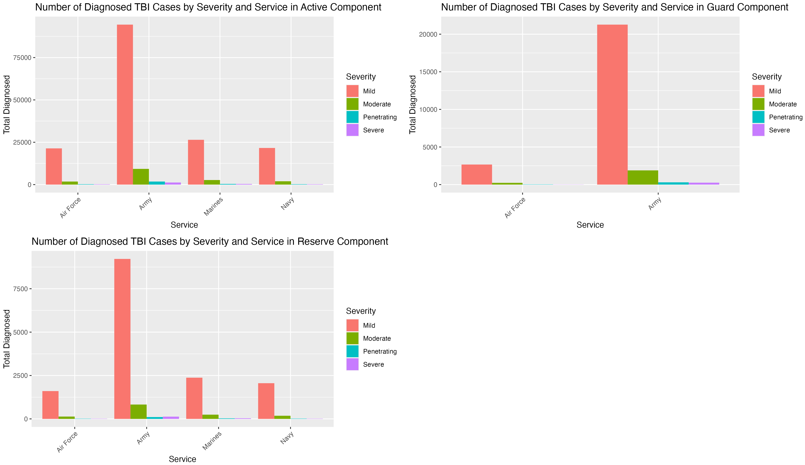
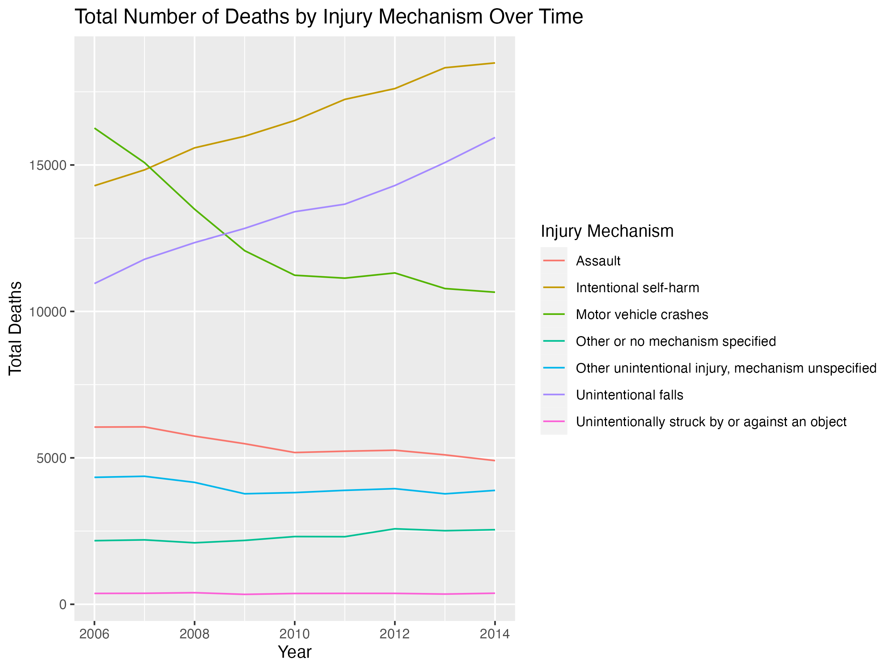
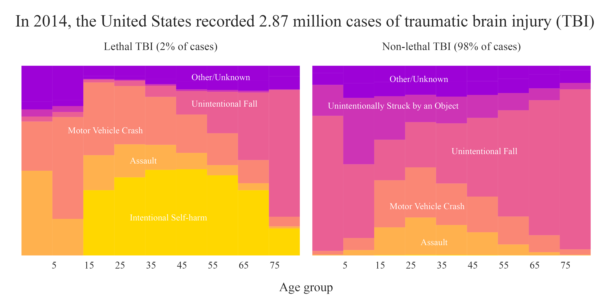

Data Analysis Report about Traumatic Brain Injury
================
Zenthia Song
2023-07-10

## Research Questions

1.  What is the distribution of TBI severity (mild, moderate, severe,
    penetrating) in different branches of the military?
2.  What is the annual trend in the number of deaths due to different
    injury mechanisms causing traumatic brain injury?
3.  What are the primary causes of traumatic brain injury (TBI)? And how
    do they affect different age groups?

## Data Description

The analysis uses three datasets:

1.  **tbi_age.csv**: This dataset provides information about Traumatic
    Brain Injury (TBI) cases categorized by age groups. The data is
    estimated for the year 2014.
    - age_group: The age group of the TBI patients.
    - type: The type of measure used in the dataset.
    - injury_mechanism: The cause or mechanism of the injury.
    - number_est: The estimated number of observed cases in 2014.
    - rate_est: The estimated rate of TBI cases per 100,000 people in
      2014.
2.  **tbi_year.csv**: This dataset provides information about TBI cases
    over different years.
    - injury_mechanism: The cause or mechanism of the injury.
    - type: The type of measure used in the dataset.
    - year: The year of observation.
    - rate_est: The estimated rate of TBI cases per 100,000 people in
      the year of observation.
    - number_est: The estimated number of observed cases in each year.
3.  **tbi_military.csv**: This dataset provides information about TBI
    cases in different branches and components of the military.
    - service: The branch of the military where the TBI case was
      reported.
    - component: The component of the military where the TBI case was
      reported (active, guard, reserve).
    - severity: The severity or type of TBI.
    - diagnosed: The number of diagnosed TBI cases.
    - year: The year of observation.

## Data Interpretation

### RQ1: What is the distribution of TBI severity (mild, moderate, severe, penetrating) in different branches of the military?

Fig.1 Distribution of TBI severity (mild, moderate, severe, penetrating)
in different branches of the military.

- The distribution of Traumatic Brain Injury (TBI) severity varies
  across different branches of the military, and it differs between
  Active, Guard, and Reserve components. In the Active component, the
  Army reported the highest number of TBI cases across all severity
  levels. Most cases were mild, with 94,447 cases, followed by moderate
  (9,274), penetrating (1,795), and severe cases (1,232). The Navy, Air
  Force, and Marines also reported high numbers of mild TBI cases, but
  fewer moderate, severe, and penetrating cases.

- In the Guard component, the Army again reported the highest number of
  cases across all severities, with the majority being mild cases
  (21,271). The Air Force reported fewer cases, but the distribution
  across severities was similar to that in the Army, with mild cases
  being the most common.

- In the Reserve component, the Army again had the highest number of
  cases. The number of mild cases in the Marines and the Navy was also
  significant. As with the other components, mild cases were most
  common, followed by moderate, severe, and penetrating cases.

- Overall, these findings suggest that mild TBI is the most common type
  of injury across all branches of the military and components. However,
  the number of moderate, severe, and penetrating injuries should not be
  overlooked, as these injuries can have significant impacts on service
  members’ health and well-being.

### RQ2: What is the annual trend in the number of deaths due to different injury mechanisms causing traumatic brain injury?

Fig.2 Estimate the observed cases of deaths by injury mechanism each
year.

- The total number of deaths due to different injury mechanisms causing
  Traumatic Brain Injury (TBI) has shown varying trends over the years.
  From 2006 to 2014, several injury mechanisms have displayed notable
  trends. Deaths due to Motor Vehicle Crashes, once the leading cause of
  TBI-related deaths in 2006 with 16,260 cases, have shown a consistent
  decline over the years, dropping to 10,656 cases by 2014. Intentional
  self-harm, on the other hand, has been on the rise, increasing from
  14,292 cases in 2006 to 18,485 cases in 2014. Unintentional falls also
  showed a steady increase, from 10,952 cases in 2006 to 15,939 cases in
  2014.

- However, deaths due to Assault have seen a gradual decrease over the
  years, with the number of cases dropping from 6,051 in 2006 to 4,906
  in 2014. Deaths due to being unintentionally struck by or against an
  object have remained relatively stable and low over the years, ranging
  from 371 cases in 2006 to 378 cases in 2014. Deaths due to other
  unspecified mechanisms have fluctuated with no discernable trend. The
  number of cases due to other unspecified mechanisms was 2,172 in 2006
  and slightly increased to 2,547 in 2014.

- These trends suggest that while some causes of TBI-related deaths have
  decreased over the years, others have increased, indicating a shift in
  the primary causes of TBI fatalities.

### RQ3: What are the primary causes of traumatic brain injury (TBI)? And how do they affect different age groups?

Fig.3 Distribution of primary causes of traumatic brain injury with the
different age groups.

- The United States recorded 2.87 million cases of Traumatic Brain
  Injury (TBI) in 2014. The data is grouped into two types of TBI:
  lethal (2% of cases) and non-lethal (98% of cases). The mechanisms of
  injury include intentional self-harm, assault, motor vehicle crashes,
  unintentional falls, being unintentionally struck by an object, and
  other/unknown mechanisms.

- The data suggests that the lethality and cause of TBIs vary by age and
  whether the injury is fatal or not. Unintentional falls are a frequent
  cause of non-lethal TBIs, but their lethality increases with age.
  Intentional self-harm is a particularly troubling cause of lethal
  TBIs, alongside motor vehicle crashes. Assaults also contribute to the
  TBI fatality rate but to a lesser extent. Interestingly, while being
  unintentionally struck by an object is a common reason for emergency
  room visits, it’s less likely to result in a fatal outcome.

- Overall, the data emphasizes the importance of preventive measures
  tailored to specific age groups and causes, such as fall prevention
  for the elderly and young children, violence reduction for young
  adults, and safe driving interventions for young drivers.

## Conclusion

- In summary, Traumatic Brain Injuries (TBIs) are a significant concern
  across the U.S. military and the general population, with varying
  severity across different military branches and components. Mild TBIs
  are most common, but moderate, severe, and penetrating injuries also
  occur, impacting health and well-being significantly. The Army
  consistently reports the highest number of TBI cases, indicating a
  high-risk environment that requires targeted prevention and treatment
  strategies.

- In the broader U.S. population, TBI mechanisms and outcomes vary by
  age and injury severity. Unintentional falls and intentional self-harm
  are leading causes of TBIs, with their impact varying by age and
  lethality. While motor vehicle crash-related TBI deaths have declined,
  they remain a considerable concern. These findings highlight the need
  for targeted TBI prevention and treatment interventions, considering
  specific risks associated with different age groups, military
  branches, and injury causes.
